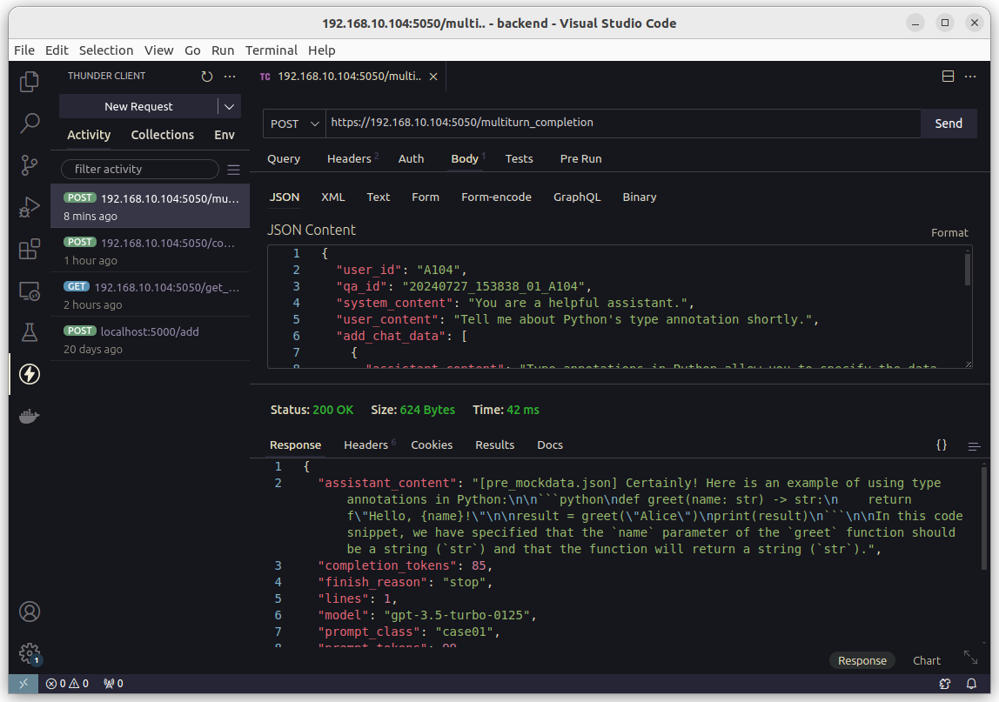
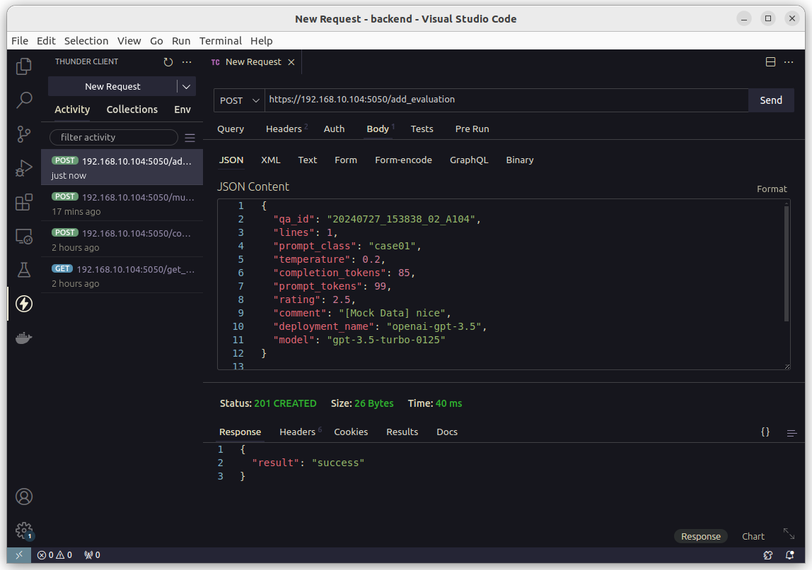

# :tanabata_tree: Overview

This project is a Question/Answering application we developed to learn prompt engineering techniques through building a GenAI application, while also gaining experience with modern development practices in languages like Python and TypeScript.

## :tada: Demo


# :book: Table of Contents

- [:tanabata\_tree: Overview](#tanabata_tree-overview)
  - [:tada: Demo](#tada-demo)
- [:book: Table of Contents](#book-table-of-contents)
- [:scroll: Features](#scroll-features)
- [:ladder: Sequence](#ladder-sequence)
- [:flower\_playing\_cards: Pre-requisites](#flower_playing_cards-pre-requisites)
  - [:postbox: OS](#postbox-os)
  - [:softball: Software](#softball-software)
- [:books: Setup \& Run](#books-setup--run)
  - [:point\_down: Step-1: Basic Configuration](#point_down-step-1-basic-configuration)
    - [(1) Download](#1-download)
    - [(2) Generating a Private key and a Self-signed Certificate](#2-generating-a-private-key-and-a-self-signed-certificate)
    - [(3) Importing a Self-Signed Certificate](#3-importing-a-self-signed-certificate)
  - [:wrench: Step-2: Setup Backend](#wrench-step-2-setup-backend)
    - [(1) Python Packages](#1-python-packages)
    - [(2) Setting Environment Variables](#2-setting-environment-variables)
    - [(3) Static Check](#3-static-check)
    - [(4) Model Definition](#4-model-definition)
    - [(5) Create Directories](#5-create-directories)
    - [(6) Create Evaluation Table](#6-create-evaluation-table)
  - [:running\_man: Step-3: Run Backend](#running_man-step-3-run-backend)
    - [(1) Run a Backend Application](#1-run-a-backend-application)
    - [(2) Send Some Requests](#2-send-some-requests)
  - [:hammer: Step-4: Setup Frontend](#hammer-step-4-setup-frontend)
    - [(1) Node Packages](#1-node-packages)
    - [(2) Setting Environment Variables](#2-setting-environment-variables-1)
    - [(3) Static Check](#3-static-check-1)
  - [:running\_woman: Step-5: Run Frontend](#running_woman-step-5-run-frontend)
    - [(1) Run a Frontend Application](#1-run-a-frontend-application)
    - [(2) Open Browser](#2-open-browser)
    - [(3) Setup and Run Mock Server](#3-setup-and-run-mock-server)
    - [(4) User Interface Instructions](#4-user-interface-instructions)
  - [:sparkles: Step-6: End-to-end Communications](#sparkles-step-6-end-to-end-communications)
    - [(1) Frontend to Backend with Mock APIs](#1-frontend-to-backend-with-mock-apis)
    - [(2) Communicate OpenAI](#2-communicate-openai)
- [:musical\_note: How To Use](#musical_note-how-to-use)
  - [:speech\_balloon: Question/Answering](#speech_balloon-questionanswering)
    - [(1) Get Modellist](#1-get-modellist)
    - [(2) Input Prompt Class](#2-input-prompt-class)
    - [(3) Input User Content](#3-input-user-content)
    - [(4) Set Temperature](#4-set-temperature)
    - [(5) Check Tokens](#5-check-tokens)
    - [(6) Set Max Tokens](#6-set-max-tokens)
    - [(7) Send](#7-send)
    - [(8) Continue Conversation](#8-continue-conversation)
  - [:memo: QA Logs](#memo-qa-logs)
    - [(1) Log File Location](#1-log-file-location)
    - [(2) QA-ID](#2-qa-id)
    - [(3) Log File Formats](#3-log-file-formats)
  - [:1st\_place\_medal: Evaluation](#1st_place_medal-evaluation)
    - [(1) Rating](#1-rating)
    - [(2) Comments](#2-comments)
    - [(3) Add Evaluation](#3-add-evaluation)
  - [:mag: Database](#mag-database)
    - [(1) Table and Schema](#1-table-and-schema)
    - [(2) Evaluation Table](#2-evaluation-table)
    - [(3) Check Saved Data](#3-check-saved-data)
- [:balance\_scale: LICENSE](#balance_scale-license)

# :scroll: Features

- Saving questions and answers: These are saved in a toml file with the date and time as the key. Some elements of the response data from OpenAI are also saved.
- You can select the model, specify temperature, max_tokens and prompt class. The prompt class can be freely specified by the user, such as the verification viewpoint or test case number.
- Saving operation logs: The flask logger is used to save backend operation and event logs, debug information, etc.

# :ladder: Sequence


# :flower_playing_cards: Pre-requisites

## :postbox: OS

We typically develop on Ubuntu, but we managed to get it running on Windows (using Git Bash) as well.

```
$ lsb_release -a
No LSB modules are available.
Distributor ID:	Ubuntu
Description:	Ubuntu 22.04.4 LTS
Release:	22.04
Codename:	jammy
$

```

The instructions below assume you are using the command line on Ubuntu (Linux) Terminal or Git Bash. For Windows-specific steps, please refer to :bulb: "Tip: for Windows".

> [!IMPORTANT]
> If you are using a multibyte language on Windows, make sure to change the system locale to Unicode UTF-8.
>
> Ref: How to Change System Locale in Windows 10
> https://www.tenforums.com/tutorials/132050-change-system-locale-windows-10-a.html
>
> Please use the `chcp` command in PowerShell to verify that the `active code page: 65001`.

## :softball: Software

- Python >= 3.10, (pyenv)
- Flask >= 3.0
- Sqlite >= 3.37
- Node >= 20.14, (nvm)
- OpenSSL >= 3.3 (probably >=3.0)

If you haven't installed these software applications yet, please refer to the notes below.

<details>
<summary> Install Python (pyenv)</summary>
Please refer to the following website. 
We'll cover the installation process for Windows later on.

https://github.com/pyenv/pyenv

First, install pyenv and set the necessary environment variables.

```
$ cd ~
$ git clone https://github.com/pyenv/pyenv.git ~/.pyenv
...
$
$ echo 'export PYENV_ROOT="$HOME/.pyenv"' >> ~/.bashrc
$ echo 'command -v pyenv >/dev/null || export PATH="$PYENV_ROOT/bin:$PATH"' >> ~/.bashrc
$ echo 'eval "$(pyenv init -)"' >> ~/.bashrc
$
```

> :bulb: **Tip:** for Windows
>
> Refer to the following website.
>
> https://github.com/pyenv-win/pyenv-win/blob/master/docs/installation.md#add-system-settings
>
> On Windows, I configured the PATH like this.
>
> First, execute the following four commands in PowerShell:
>
> ```
> [System.Environment]::SetEnvironmentVariable('PYENV',$env:USERPROFILE + "\.pyenv\pyenv-win\","User")
>
> [System.Environment]::SetEnvironmentVariable('PYENV_ROOT',$env:USERPROFILE + "\.pyenv\pyenv-win\","User")
>
> [System.Environment]::SetEnvironmentVariable('PYENV_HOME',$env:USERPROFILE + "\.pyenv\pyenv-win\","User")
>
> [System.Environment]::SetEnvironmentVariable('path', $env:USERPROFILE + "\.pyenv\pyenv-win\bin;" + $env:USERPROFILE + "\.pyenv\pyenv-win\shims;" + [System.Environment]::GetEnvironmentVariable('path', "User"),"User")
> ```
>
> Next, check to see if the environment variables are set correctly:
>
> > Open the Control Panel.
> >
> > Click System and Security, then System
> >
> > Click Advanced system settings on the left
> >
> > Inside the System Properties window, click the Environment Variables… button.

Check if the `pyenv` command can be executed.

```
$ pyenv --version
pyenv 3.1.1
$
```

Next, check the available Python versions and install them by specifying the version number.

```
$ pyenv install --list
Available versions:
  2.1.3
  2.2.3
...
$
$ pyenv install 3.12.4
Downloading Python-3.12.4.tar.xz...
...
$
$ pyenv versions
* system (set by (your-home)/.pyenv/version)
  3.12.4
$
$ which python
(your-home)/.pyenv/shims/python
$
$ pyenv global 3.12.4
$ pyenv local 3.12.4
$ pyenv version
3.12.4 (set by (your-home)/.python-version)
$ python --version
Python 3.12.4
$ pip --version
pip 24.0 from (your-home)/.pyenv/versions/3.12.4/lib/python3.12/site-packages/pip (python 3.12)
$
```

> :bulb: **Tip:** for Windows
>
> On Windows (Git Bash), the path to python will look something like this:
>
> ```
> $ which python
> /c/Users/(user-name)/.pyenv/pyenv-win/shims/python
> ```
>
> Please ensure that Python can be started on PowerShell.

</details>

<details>
<summary>Install Flask</summary>
Please refer to the following website.

https://flask.palletsprojects.com/en/3.0.x/installation/#install-flask

```
$ pip install Flask
...
$
$ flask --version
Python 3.12.4
Flask 3.0.3
Werkzeug 3.0.3
$
```

</details>

<details>
<summary>Install Sqlite</summary>
For ubuntu, you can install it as follows.

```
$ sudo apt install sqlite3
...
$
$ which sqlite3
/usr/bin/sqlite3
$ sqlite3 --version
3.37.2 2022-01-06 13:25:41 872ba......
$
```

> :bulb: **Tip:** for Windows
>
> Here's an example of installing SQLite on Windows. While you can certainly set the path using a GUI, this example uses the command line.
>
> (1) Visit the following site and download "sqlite-tools-win-x64-3460000.zip (4.80MiB)".
>
> https://www.sqlite.com/download.html
>
> (2) Create a folder named "devpgm" at the root of the C drive, and then create another folder named "sqlite3" inside it.
>
> (3) Unzip the downloaded zip file and move the three files ("sqldiff.exe", "sqlite3.exe", and "sqlite3_analyzer.exe") to the "C:\devpgm\sqlite3" folder.
>
> (4) PowerShell run as Administrator.
>
> (5) Run the following command in PowerShell.
>
> ```
> > $newPath = "C:\devpgn\sqlite3"
> > Write-Output $newPath
> C:\devpgn\sqlite3
> > $currentPath = [System.Environment]::GetEnvironmentVariable("Path", [System.EnvironmentVariableTarget]::Machine)
> > Write-Output $currentPath
> ... (your-current-path) ...
> > $newPath = $currentPath + ";" + $newPath
> > Write-Output $newPath
> ... (your-current-path);C:\devpgn\sqlite3
> > [System.Environment]::SetEnvironmentVariable("Path", $newPath, [System.EnvironmentVariableTarget]::Machine)
> >
> ```
>
> (6) Check PATH
>
> ```
> $ which sqlite3
> /c/devpgm/sqlite3/sqlite3
> $
> ```

</details>

<details>
<summary>Install Node (nvm)</summary>
Please refer to the following website.

https://github.com/nvm-sh/nvm

First, install nvm.

```
$ curl -o- https://raw.githubusercontent.com/nvm-sh/nvm/v0.39.7/install.sh | bash
...
$ nvm --version
0.39.7
$
```

Next, check the available Node versions and install them by specifying the version number.

```
$ nvm ls-remote
  v0.1.14
  v0.1.15
  ...
$
$ nvm install v20.14.0
Downloading and installing node v20.14.0...
...
$ node --version
v20.14.0
$
```

> :bulb: **Tip:** for Windows
>
> Install and use NVM for Windows.
> You need to create a folder named "devpgm" at the root of the C drive. (see "Install sqlite")
>
> (1) Access the following website and click the "Latest" button in the "Releases" section on the right side of the page.
>
> https://github.com/coreybutler/nvm-windows/
>
> (2) Download and unzip "nvm-setup.zip" from the "Assets" section.
>
> (3) Run "nvm-setup.exe" to start the installation.
>
> (4) When prompted for the location during installation, set it as follows:
>
> - Select Destination Location: C:\devpgm\nvm
> - Set Node.js Symlink: C:\devpgm\nodejs
>
> (5) After installing NVM for Windows, use Git Bash to check the available Node.js versions and install the desired version.
>
> ```
> $ nvm --version
> 1.1.12
> $ nvm list available
> ...
> $ nvm install 20.15.0
> $ nvm use 20.15.0
> $ nvm list
>   *20.15.0 (Currentry using 64-bit executable)
>    18.16.1
> $ node --version
> v20.15.0
> $
> ```

</details>

<details>
<summary> Install OpenSSL</summary>
First, download the latest version from the official website.

https://www.openssl.org/source/

(As of July 14, 2024, the latest version is 3.3.1.)

Next, Run these commands one after the other.
```
$ cd (your-dir)
$ mkdir setup
$ cd setup
$ tar xf openssl-3.3.1.tar.gz
$ cd openssl-3.3.1
$ sudo apt install build-essential
$ make
$ sudo make install
$ openssl version
openssl: /lib/x86-64-linux-gnu/libssl.so.3 not found ...
```

As you can see above, we ran into an error that showed we needed to set the path to the shared library. So, set the path like this:
```
$ export LD_LIBRARY_PATH=(your-dir)/setup/openssl-3.3.1:$LD_LIBRARY_PATH
$ openssl version
OpenSSL 3.3.1.4 Jun 2024 (Library: OpenSSL 3.3.1.4 Jun 2024)
$
```

> :bulb: **Tip:** for Windows
>
> Here's an example of installing OpenSSL on Windows.
>
> (1) Visit the following site and download "Win64OpenSSL-3_3_1.msi".
>
> https://slproweb.com/products/Win32OpenSSL.html
>
> (2) Install
> - Slect Destination Location : C:\devpgm\openssl
> - Select Start Menu Folder : OpenSSL
> - Select Additional Tasks : The OpenSSL binaries (/bin) directory
> - Push "Install" button
>
> (3) Setup
> - Opening run command ("Win" + "R")
> - Type `"SystemPropertiesAdvanced"` and press ENTER
> - click on the ‘Environment Variables’ button
> - Modify the System Path: Within the Environment Variables window, scroll to find the ‘Path’ variable under the ‘System Variables’ section. Select it and then click the ‘New’ button.
> - set "C:\devpgm\openssl"
>
> (4) Check
> 

</details>

# :books: Setup & Run

The steps outlined here might seem a bit tedious process, but if you try to do everything at once and it doesn't work, it will be difficult to identify the cause. :slightly_smiling_face: More haste, less speed.

## :point_down: Step-1: Basic Configuration

### (1) Download

Create your project directory and download programs.

```
$ mkdir (your-dir)
$ cd (your-dir)
$ git clone https://github.com/ottawan25/quaet.git
```

### (2) Generating a Private key and a Self-signed Certificate

First, we’ll create a private key.
```
$ cd (your-dir)/quaet
$ cd keys
$ openssl genpkey -out server.key -algorithm RSA -pkeyopt rsa_kgen_bits:2048
```
This will generate a `"server.key"` file in the current directory with the private key.

Next, we need a certificate signing request (CSR). The CSR includes the public key and some additional information (such as organization and country).

Here's some key info to get you started:

- When using the "-addext" option, make sure the IP address you specify is IPv4 and matches your local machine's IP address.
- For the fields "Country Name," "State," "Organization Name," and "Common Name," be sure to enter appropriate values. You can skip the other fields by just hitting the return key.
- For "Common Name," enter the same IP address you used with the "-addext" option.

Here are some example commands. Make sure to follow the guidelines above and avoid copy-pasting them directly.
```
$ openssl req -new -key server.key -out server.csr -addext "subctAltName=IP:192.168.10.104"
You are about to be asked to enter information that will be incporated
into your certificate request.
What you are about to enter is what is called a Distinguished Ne or a DN.
There are quite a few fields but you can leave some blank
For some fields there will be a default value,
If you enter '.', the field will be left blank.
-----
Country Name (2 letter code) [AU]:JP
State or Province Name (full name) [Some-State]:Tokyo
Locality Name (eg, city) []:
Organization Name (eg, company) [Internet Widgits Pty Ltd]:quaet
Organizational Unit Name (eg, section) []:
Common Name (e.g. server FQDN or YOUR name) []:192.168.10.104
Email Address []:

Please enter the following 'extra' attributes
to be sent with your certificate request
A challenge password []:
An optional company name []:

$

```
This will generate a `"server.csr"` file in the current directory.

And then, create a self-signed certificate (`"server.crt"`) with our existing private key (`"server.key"`) and CSR (`"server.csr"`):
```
$ openssl x509 -in server.csr -out server.crt -req -signkey server.key -days 3650 -copy_extensions copy
Certificate request self-signature ok
subject=C=JP, ST=Tokyo, O=quaet, CN=192.168.10.104

$
```
The values you enter will show up as "subject", "ST", "O", and "CN".
Note: The "-copy_extensions" option is likely available in OpenSSL version 3 and later.

### (3) Importing a Self-Signed Certificate
In the following steps, you'll start the backend and frontend servers. However, if you don't import the self-signed certificate into your browser settings, you might encounter the following warning screen or an authentication error. To prevent this, follow the steps below to import the self-signed certificate (server.crt) you just created.


Here are the steps for Chromium browsers (Chrome, Edge, ...).


First, install the necessary tool (certutil).
```
$ sudo apt install libnss3-tools
...
$ which certutil
/usr/bin/certutil
$
```
Next, check all installed certificates.
```
$ certutil -d sql:$HOME/.pki/nssdb -L

Certificate Nickname                                         Trust Attributes
                                                             SSL,S/MIME,JAR/XPI

$ 
```
Next, import the self-signed certificate (server.crt) you just created.
```
$ certutil -d sql:$HOME/.pki/nssdb -A -t "P,," -n "quaet" -i ./server.crt
$ certutil -d sql:$HOME/.pki/nssdb -L

Certificate Nickname                                         Trust Attributes
                                                             SSL,S/MIME,JAR/XPI

qae                                                          P,,  
$ 
```

> :bulb: **Tip:** for Windows
>
> Here's an example of importing self-signed certificate in your Chromium browser.
>
> (1) Go to "Menu"-"Settings", select "Privacy and Security", "Advanced" section and click "Manage certificates".

> (2) In the "Certificate" window switch to the Trusted Root Certification Authorities tab and press the "Import..." button. In the Certificate Import Wizard window that appears click the "Next >" button.

> (3) To select the file, press the "Browse..." button.

> (4) Find the saved certificate file on your hard disk and click the "Open" button.

> (5) Then click the "Next >" button.

## :wrench: Step-2: Setup Backend

### (1) Python Packages

First, install the packages defined in requirements.txt

```
$ cd (your-dir)/quaet/backend
$ pip install -r requirements.txt
...
$
```

### (2) Setting Environment Variables

To run the backend server, you need to set some environment variables. Here is an example:

**[(your-dir)/quaet/backend/.env]**

```
# --- for flask ---
FLASK_APP="app.py"
FLASK_DEBUG=1
FLASK_RUN_HOST="0.0.0.0"
FLASK_RUN_PORT=5050
FLASK_RUN_KEY="../keys/server.key"
FLASK_RUN_CERT="../keys/server.crt"

# --- for input ---
# OpenAI API Key
OPENAI_API_KEY="sk-xxxxx"
#AZURE_OPENAI_API_KEY="xxxxx"

# Available Model Definitions
PRE_DEF_MODEL=".model_env.toml"

# OpenAI API Runmode
#PRE_RUNMODE="Mock"		# Runmode: "Mock" or comment out

# Mockdata for OpenAI API Response 
PRE_MOCKDATA_FILE="./pre_mockdata.json"

# --- for output ---

# Event/Debug Log Directory (.log)
PRE_LOG_DIR="./log/"

# QA Log (.toml)
PRE_QA_LOG_DIR="./qa_log/"

# Sqlite3 Database
PRE_DB_URI="sqlite:///qa_db/qae.db"


```

<details>
<summary>Descriptions</summary>

**[for flask]**

Environment variables for starting Flask. We'll skip the details here.

**[for input]**

**OPENAI_API_KEY (AZURE_OPENAI_API_KEY)**

As the name suggests.

https://platform.openai.com/docs/quickstart

**PRE_DEF_MODEL**

Specifies the file name that defines the available models.

**PRE_RUN_MODE**

If you set the string "Mock", a mock version of the OpenAI API will be used (no requests will be sent to OpenAI).

**PRE_MOCKDATA_FILE**

If the above PRE_RUN_MODE is set to "Mock", specify the file name that contains the mock response content equivalent to the response from the OpenAI API.

**PRE_LOG_DIR**

Specifies the directory where event logs and debug logs will be stored when the backend server is running.

**PRE_QA_LOG_DIR**

When making a request with the OpenAI API, the parameter values, request details, and some elements of the response object are saved in a TOML file. This variable specifies where the file is stored.

**PRE_DB_URI**

The QA information, stored as a TOML file in the specified directory, is recorded as a table with a unique QA-ID and its corresponding rating. This variable specifies the database name in URI format.

</details>

### (3) Static Check

While this isn't directly related to running the program, we'll outline three types of static check procedures to help organize the methods for statically checking application programs. These check procedures are applicable not only to the backend (Python code) but also to the frontend (TypeScript code), which we will discuss later.

**Format Check**

```
$ ruff format --check pre*.py
13 files already formatted
$
```

**Style Check**

```
$ ruff check pre*.py
All checks passed!
$
```

**Type Check**

```
$ mypy *.py
Success: no issues found in 14 source files
$

```

### (4) Model Definition

Specify the connection details for the model you want to use. Write to the file specified by the PRE_DEF_MODEL environment variable.

<details>
<summary>Descriptions</summary>

This is a sample file.

[.model_env.toml]

```
# Model Definition Table
[[model]]
name = "openai-gpt-3.5"
llm_service = "OpenAI"
deployment_name = "gpt-3.5-turbo"
api_key = "OPENAI_API_KEY"

[[model]]
name = "azure-gpt-3.5"
llm_service = "Azure"
deployment_name = "dp02-gpt35"
api_key = "AZURE_OPENAI_API_KEY"
api_version = "2024-02-01"
azure_endpoint = "https://xxx.openai.azure.com"

```

**name**

This key represents the connection information for the model, and users can freely specify a name for it. The name defined here will be displayed in a list on the frontend and used to select the model you want to use.

**llm_service**

Currently, only "OpenAI" and "Azure" can be specified.

**deployment_name**

The name of the model used when sending requests to the OpenAI.

**api_key**

Rather than specifying the API_KEY directly, use the environment variable name defined in your .env file, such as OPENAI_API_KEY or AZURE_OPENAI_API_KEY.

**api_version**

(Azure only) Specify the API version when creating an AzureOpenAI instance.

**api_endpoint**

(Azure only) Specify the API endpoint when creating an AzureOpenAI instance.

</details>

### (5) Create Directories

Next, create the three directories needed to start the backend server. Create it in the (your-dir)/quaet/backend directory.

**Event/Debug Log Dir**

Create a directory named as specified by the PRE_LOG_DIR environment variable.

```
$ mkdir log
```

**QA Log Dir**

Create a directory named as specified by the PRE_QA_LOG_DIR environment variable.

```
$ mkdir qa_log
```

**QA DB Dir**

This matches the directory name specified in PRE_DB_URI.

```
$ mkdir qa_db
```

### (6) Create Evaluation Table

Run this command. Then, use the sqlite3 command to see if the table was created.

```
$ python pre_setup.py
...
$ sqlite3 qa_db/qae.db
SQLite version 3.37.2 2022-01-06 13:25:41
Enter ".help" for usage hints.
sqlite> .tables
evaluation
sqlite> .schema evaluation
CREATE TABLE evaluation (
	id INTEGER NOT NULL, 
	qa_id VARCHAR NOT NULL, 
	lines INTEGER NOT NULL, 
	prompt_class VARCHAR NOT NULL, 
	temperature FLOAT NOT NULL, 
	completion_tokens INTEGER NOT NULL, 
	prompt_tokens INTEGER NOT NULL, 
	rating FLOAT NOT NULL, 
	comment VARCHAR NOT NULL, 
	deployment_name VARCHAR NOT NULL, 
	model VARCHAR NOT NULL, 
	PRIMARY KEY (id)
);
sqlite> .quit
$ 
```

The backend environment setup is now complete. Next, we will verify the backend startup independently (without using the frontend app).

## :running_man: Step-3: Run Backend

### (1) Run a Backend Application

To run the application, use the flask command.
The IP address displayed is your local machine's actual IP address.

```
$ flask run
 * Serving Flask app 'app.py'
 * Debug mode: on
WARNING: This is a development server. Do not use it in a production deployment. Use a production WSGI server instead.
 * Running on all addresses (0.0.0.0)
 * Running on https://127.0.0.1:5050
 * Running on https://192.168.10.104:5050
Press CTRL+C to quit
 * Restarting with stat
 * Debugger is active!
 * Debugger PIN: 631-712-660

```

### (2) Send Some Requests

> [!NOTE]
> Before performing the following operations, ensure that the "run-mode" is set to mock mode.
> PRE_RUNMODE="Mock"

Send a request to the backend server using an API client tool. For example, you can use Thunder Client, a VSCode extension. First, send a request to the endpoint below using the GET method to verify if you can retrieve the response data (a list of model connection information).

- URL: https://(your-ip-address):5050/get_modellist
- Method: GET


This JSON data is based on the contents of the file specified by the environment variable PRE_DEF_MODEL.


Next, send a POST request with the data from "apitest/req_post_count_tokens.json".

- URL: https://(your-ip-address):5050/count_tokens
- Method: POST
- Json Data: see below (apitest/req_post_count_tokens.json)
```json
{
  "system_content": "You are a helpful assistant.",
  "user_content": "Hi, there.",
  "add_chat_data": [],
  "selected_model": "openai-gpt-3.5"
}
```

> [!TIP]
> In ThunderClient, you might find that selecting "Edit" and "Paste" from the menu doesn’t work. If that happens, try using "Ctrl-V" to paste.

After you click the "Send" button, make sure you see a response with status 200.


Next, send a POST request with the data from "apitest/req_post_multiturn_completion.json".

- URL: https://(your-ip-address):5050/multiturn_completion
- Method: POST
- Json Data: see below (apitest/req_post_multiturn_completion.json)

```json
{
  "user_id": "A104",
  "qa_id": "20240727_153838_01_A104",
  "system_content": "You are a helpful assistant.",
  "user_content": "Tell me about Python's type annotation shortly.",
  "add_chat_data": [
    {
      "assistant_content": "Type annotations in Python allow you to specify the data types of variables, function parameters, and return values. They are optional but can help improve code readability and catch errors early. Python's type hinting system was introduced in PEP 484 and has since been enhanced in later versions of the language.",
      "user_content": "Show me sample code."
    }
  ],
  "selected_model": "openai-gpt-3.5",
  "prompt_class": "case01",
  "temperature": 0.2,
  "max_tokens": 4000
}
```


After you click the "Send" button, make sure you see a response with status 200.



As a side note, the response data is generated based on the contents of pre_mockdata.json, which is specified by the environment variable PRE_MOCKDATA_FILE.

And then, send a request to the add_evaluation endpoint using the POST method. Use apitest/req_post_add_evaluation.json as the data to be sent.

- URL: https://(your-ip-address):5050/add_evaluation
- Method: POST
- Json Data: see below (apitest/req_post_add_evaluation.json)

```json
{
  "qa_id": "20240727_153838_02_A104",
  "lines": 1,
  "prompt_class": "case01",
  "temperature": 0.2,
  "completion_tokens": 85,
  "prompt_tokens": 99,
  "rating": 2.5,
  "comment": "[Mock Data] nice",
  "deployment_name": "openai-gpt-3.5",
  "model": "gpt-3.5-turbo-0125"
}

```



If these three requests function correctly, you can verify that the backend server environment has been set up correctly. Once the backend server environment is established, you can proceed to configure the frontend server environment.

## :hammer: Step-4: Setup Frontend

### (1) Node Packages

Install the required Node.js packages base on the downloaded package.json.

```
$ cd (your-dir)/quaet/frontend
$ npm install
```

### (2) Setting Environment Variables

To run the frontend server, you need to set some environment variables. Here is an example:

<details>
<summary>Descriptions</summary>

**(your-dir)/quaet/frontend/.env**

```
# Private Key
NEXT_PUBLIC_QAE_PRIVATE_KEY=../keys/server.key

# Self-signed Certificate
NEXT_PUBLIC_QAE_CERTIFICATE=../keys/server.crt

# Network Interface Name
NEXT_PUBLIC_NETWORK_INTERFACE="wlp0*"

# Backend API Server URL
#NEXT_PUBLIC_API_SERVER_URL=https://(your-ip-address):5050
NEXT_PUBLIC_API_SERVER_URL=https://(your-ip-address):3030

# Default System Content
NEXT_PUBLIC_SYSTEM_CONTENT="You are a helpful assistant."

# App Version
NEXT_PUBLIC_APP_VERSION=$npm_package_version

# Content Rows
NEXT_PUBLIC_SYSTEM_CONTENT_ROWS=3
NEXT_PUBLIC_USER_CONTENT_ROWS=5
NEXT_PUBLIC_ASSISTANT_CONTENT_ROWS=7

```

**NEXT_PUBLIC_QAE_PRIVATE_KEY**

Set the private key created in Step 1.

**NEXT_PUBLIC_QAE_CERTIFICATE**

Set the self-signed certificate created in Step 1.

**NEXT_PUBLIC_NETWORK_INTERFACE**

Specify the network interface name on your local machine. It should be an IPv4 name. You can also use a regular expression.

You can check the network interface name using the `"ip a"` command (or `"ipconfig"` on Windows with Git Bash).

**NEXT_PUBLIC_API_SERVER_URL**

Specifies the URL of the backend server.
You can switch this setting to alternate between a mock backend server and a real server.

**NEXT_PUBLIC_SYSTEM_CONTENT**

Set the default system message. You can also change this value from the UI. For more details, refer to the following website:

https://platform.openai.com/docs/guides/text-generation


**NEXT_PUBLIC_APP_VERSION**

This component reads the application version information from package.json and displays it on the screen. Please do not modify this item.

The front-end server environment setup is now complete. Next, verify that the server is running.

**NEXT_PUBLIC_SYSTEM_CONTENT_ROWS**

**NEXT_PUBLIC_USER_CONTENT_ROWS**

**NEXT_PUBLIC_ASSISTANT_CONTENT_ROWS**

Set the default number of lines shown for the content message text field on the screen. You can also change the number of lines dynamically by using the shortcut keys below after activating each field.

- Use [Alt] + [+] : to add 5 more lines.
- Use [Alt] + [-] : to reduce 5 lines.

</details>

### (3) Static Check

Similar to the front end (Python code), we perform three types of static checks.

**Format Check**

Use Prettier to check your code. The main rules are defined in the ".prettierrc" file located in the root of the frontend directory. For more details, check the URL below.

https://prettier.io/docs/en/options.html


```
$ npx prettier --check src/
Checking formatting...
All matched files use Prettier code style!
$
```

**Style Check**

Currently, we are using the ".eslintrc.json" file located in the frontend directory for linting. If you know of any better methods or additional rules we should include, please let us know. Also, refer to the following sites for more information.

https://nextjs.org/docs/pages/building-your-application/configuring/eslint

https://eslint.org/docs/latest/rules/

```
$ npm run lint

> qae_app@0.1.0 lint
> next lint

✔ No ESLint warnings or errors
$
```

**Type Check**

If the type check passes, no messages will be output.
For more details, see below.

https://www.typescriptlang.org/tsconfig/

```
$ npx tsc --showConfig
{
    "compilerOptions": {
        "lib": [
            "dom",
            "dom.iterable",
            "esnext"
        ],
        "allowJs": true,
        "skipLibCheck": true,
        "strict": true,
        "noEmit": true,
        "esModuleInterop": true,
        "module": "esnext",
        "moduleResolution": "bundler",
        "resolveJsonModule": true,
        "isolatedModules": true,
        "jsx": "preserve",
        "incremental": true,
        "plugins": [
            {
                "name": "next"
            }
        ],
        "paths": {
            "@/*": [
                "./src/*"
            ]
        },
        "allowSyntheticDefaultImports": true,
        "resolvePackageJsonExports": true,
        "resolvePackageJsonImports": true,
        "preserveConstEnums": true,
        "noImplicitAny": true,
        "noImplicitThis": true,
        "strictNullChecks": true,
        "strictFunctionTypes": true,
        "strictBindCallApply": true,
        "strictPropertyInitialization": true,
        "alwaysStrict": true,
        "useUnknownInCatchVariables": true
    },
    "files": [
        "./next-env.d.ts",
        "./src/theme.ts",
        "./src/app/api/interfaces.ts",
        "./src/app/api/userid/route.ts",
        "./src/app/quaet/types.ts",
        "./src/app/quaet/util/api.ts",
        "./src/app/layout.tsx",
        "./src/app/page.tsx",
        "./src/app/quaet/page.tsx",
        "./src/app/quaet/components/AssistantContent.tsx",
        "./src/app/quaet/components/Center.tsx",
        "./src/app/quaet/components/HeaderContent.tsx",
        "./src/app/quaet/components/LeftSideBar.tsx",
        "./src/app/quaet/components/NavBar.tsx",
        "./src/app/quaet/components/RightSideBar.tsx",
        "./src/app/quaet/components/SystemContent.tsx",
        "./src/app/quaet/components/UserContent.tsx",
        "./.next/types/app/layout.ts",
        "./.next/types/app/api/userid/route.ts",
        "./.next/types/app/quaet/page.ts"
    ],
    "include": [
        "next-env.d.ts",
        "**/*.ts",
        "**/*.tsx",
        ".next/types/**/*.ts"
    ],
    "exclude": [
        "node_modules"
    ]
}
$
$ npx tsc
$
```

## :running_woman: Step-5: Run Frontend

### (1) Run a Frontend Application

This application will always run in development mode. The purpose of this project is to learn prompt engineering techniques and explore modern development methods simultaneously.

Run the frontend server.

```
$ cd (your-dir)/quaet/frontend
$ npm run dev

> qae_app@0.2.0 dev
> node ./server.mjs

> Ready on https://192.168.10.104:4300

```

### (2) Open Browser

Open your web browser and enter the following URL:

URL: https://(your-ip-address):4300/quaet


### (3) Setup and Run Mock Server

To verify the frontend application is working, start the backend mock. Begin by setting up the backend mock environment.

**Setup a mock server**

Install the packages required for mock startup.

```
$ cd (your-dir)/quaet/back_mock
$ npm install
...
$
```
Next, create a .env file directly under the back_mock directory as shown below.
```
# Private Key
PRE_PRIVATE_KEY=../keys/server.key

# Self-signed Certificate
PRE_CERTIFICATE=../keys/server.crt

```

**Run a mock server**

Start the mock. If it starts successfully, the following log will be displayed.

```
$ node mock.mjs
20240728 08:22:48.430 INFO  Server running on port 3030`

```

After verifying that the mock is working, the next step is to review the user interface instructions.

### (4) User Interface Instructions

**Get Modellist**

First, click the 'get_modellist' button in your browser to verify that the model names are displayed.


On the mock side, verify that a log is generated indicating the mock data (get_modellist.json) has been loaded.

```
20240728 08:31:44.488 INFO  --- POST(/get_modellist) request received ---
20240728 08:31:44.489 INFO  --- POST response ---
```

**Tokens**

Next, click the "tokens" button and make sure the token values (User, Total) are shown.


**Ask Question**

Next, input appropriate strings into the Prompt Class and "User..." fields, then click send button.


**Add Evaluation**

Set the Rating slider to 1.5 and enter text in the Comment field to enable the 'Add Evaluation' button.


Click the “Add Evaluation” button. Ensure that the "Added Successfully" message is displayed.


> [!NOTE]
> The "Added Successfully" message will automatically disappear after a few seconds.

Instructions confirmation is now complete. In the next step, we will establish end-to-end communication from the frontend to the backend and OpenAI, conducting final operational checks.

## :sparkles: Step-6: End-to-end Communications

### (1) Frontend to Backend with Mock APIs

**Run a backend server**

Start the backend server at this point, still specifying PRE_RUNMODE='Mock'.

```
$ flask run
 * Serving Flask app 'app.py'
 * Debug mode: on
WARNING: This is a development server. Do not use it in a production deployment. Use a production WSGI server instead.
 * Running on all addresses (0.0.0.0)
 * Running on https://127.0.0.1:5050
 * Running on https://192.168.10.104:5050
Press CTRL+C to quit
 * Restarting with stat
 * Debugger is active!
 * Debugger PIN: 840-748-832

```

**Switch from mock to real**

Adjusting frontend environment settings. Set the environment variable NEXT_PUBLIC_API_SERVER_URL to the address (including the port number) of the Flask Server you have just started.

```
$ cd (your-dir)/quaet/frontend
$ vim .env  (<== you need to edit .env file)

# Backend API Server URL
NEXT_PUBLIC_API_SERVER_URL=https://192.168.10.104:5050
#NEXT_PUBLIC_API_SERVER_URL=https://192.168.10.104:3030

```

**Run a frontend server**

Run the frontend server.

```
$ npm run dev

> qae_app@0.2.0 dev
> node ./server.mjs

> Ready on https://192.168.10.104:4300

```

**Open Browser**

Open your web browser and enter the following URL:

URL: https://(your-ip-address):4300/quaet

**Some Instructions**

Click the "Get Modellist" button, and check the backend server console log.

```
20240728 09:11:37.909 INFO     app      GET /get_modellist received
20240728 09:11:37.912 INFO     app      GET /get_modellist return
192.168.10.104 - - [28/Jul/2024 09:11:37] "GET /get_modellist HTTP/1.1" 200 -
```

Next, input appropriate strings into the Prompt Class and User... fields, click the send button.


Now, check the directory below to verify if a QA log has been created by the current query.

```
$ cd (your-dir)/quaet/backend/qa_log
$ cat 20240728_091738_01_A104.toml 
[qa_request]
qa_id = "20240728_091738_01_A104"
current_datetime = "20240728_091738"
deployment_name = "gpt-3.5-turbo"
temperature = 0.2
max_tokens = 4000
prompt_class = "case02"
[[qa_request.messages]]
role = "system"
content = "You are a helpful assistant."

[[qa_request.messages]]
role = "user"
content = "Paris 2024 Olympic Games will be held."

[qa_response]
finish_reason = "stop"
created = 1722062473
model = "gpt-3.5-turbo-0125"
content = "[pre_mockdata.json] Certainly! Here is an example of using type annotations in Python:\n\n```python\ndef greet(name: str) -> str:\n    return f\"Hello, {name}!\"\n\nresult = greet(\"Alice\")\nprint(result)\n```\n\nIn this code snippet, we have specified that the `name` parameter of the `greet` function should be a string (`str`) and that the function will return a string (`str`)."
completion_tokens = 85
prompt_tokens = 99
total_tokens = 184
$ 
```

> [!NOTE]
> The directory name qa_log corresponds to the name specified by the environment variable PRE_QA_LOG_DIR.
> The response data is generated based on mock data (pre_mockdata.json).

### (2) Communicate OpenAI

After stopping the backend you started earlier, modify the '.env' file.

- Verify that the correct value is set for OPENAI_API_KEY (AZURE_OPENAI_API_KEY).
- Comment out PRE_RUNMODE.
```
# OpenAI API Runmode
#PRE_RUNMODE="Mock"		# Runmode: "Mock" or comment out
```

After restarting the frontend and the browser, repeat the previous steps and click send button. Verify the response data from OpenAI.


To verify if the result indeed comes from OpenAI, let's inspect the logs. You should find 'app.log' created in the log directory. If the log at that timestamp contains 'OpenAI API Call' and includes the following entry, it confirms receipt of the response message from OpenAI. The log directory is specified by the environment variable PRE_LOG_DIR.

```
$ cat app.log
...
20240728 09:28:06.094 INFO     app      POST /multiturn_completion received
20240728 09:28:06.094 DEBUG    app      <Request 'https://192.168.10.104:5050/multiturn_completion' [POST]>
20240728 09:28:06.095 DEBUG    app      - multiturn_completion called -
20240728 09:28:06.095 DEBUG    app      -- [011] request_data : RequestData(user_id='A104', qa_id='', system_content='You are a helpful assistant.', user_content="How's it going ?", add_chat_data=[], selected_model='openai-gpt-3.5', prompt_class='case03', temperature=0.2, max_tokens=4000)
20240728 09:28:06.100 DEBUG    app      -- [022] llm_service : OpenAI
20240728 09:28:06.106 DEBUG    app      -- [111] qa_id: 20240728_092806_01_A104
20240728 09:28:06.106 DEBUG    app      -- [121] lines: 1
20240728 09:28:06.106 DEBUG    app      messages: [{'role': 'system', 'content': 'You are a helpful assistant.'}, {'role': 'user', 'content': "How's it going ?"}]
20240728 09:28:06.107 DEBUG    app      -- [221] Real mode
20240728 09:28:06.107 DEBUG    app      -- [231] client.chat.completions.create()
20240728 09:28:06.107 DEBUG    app      model: gpt-3.5-turbo
20240728 09:28:06.107 DEBUG    app      messages: [{'role': 'system', 'content': 'You are a helpful assistant.'}, {'role': 'user', 'content': "How's it going ?"}]
20240728 09:28:06.107 DEBUG    app      temperature: 0.2
20240728 09:28:06.107 DEBUG    app      max_tokens: 4000
20240728 09:28:07.055 DEBUG    app      -- [241] response (json format)
20240728 09:28:07.055 DEBUG    app      {
  "id": "chatcmpl-9pm3aNufgidRSthdLUEozS998A6gU",
  "choices": [
    {
      "finish_reason": "stop",
      "index": 0,
      "logprobs": null,
      "message": {
        "content": "Hello! I'm here and ready to assist you. How can I help you today?",
        "role": "assistant",
        "function_call": null,
        "tool_calls": null
      }
    }
  ],
  "created": 1722126486,
  "model": "gpt-3.5-turbo-0125",
  "object": "chat.completion",
  "system_fingerprint": null,
  "usage": {
    "completion_tokens": 18,
    "prompt_tokens": 22,
    "total_tokens": 40
  }
}
20240728 09:28:07.055 DEBUG    app      -- [311] qa_log_dir: ./qa_log/
20240728 09:28:07.055 DEBUG    app      -- [411] response_data: ResponseData(qa_id='20240728_092806_01_A104', finish_reason='stop', assistant_content="Hello! I'm here and ready to assist you. How can I help you today?", completion_tokens=18, prompt_tokens=22, lines=1, prompt_class='case03', temperature=0.2, model='gpt-3.5-turbo-0125')
20240728 09:28:07.055 DEBUG    app      - multiturn_completion return -
20240728 09:28:07.056 INFO     app      POST /multiturn_completion return
$
```

# :musical_note: How To Use

## :speech_balloon: Question/Answering

When you start backend and frontend servers and access them from a browser, the following initial screen will be displayed.


### (1) Get Modellist

Press the button and select the model you want to use from the list.

### (2) Input Prompt Class

The Prompt class represents a perspective for experimenting with various prompts. It will also serve to categorize prompts by this perspective when evaluating their values in the future. Entering concise strings will facilitate easier analysis.

### (3) Input User Content

There are three ways to enter user content:

**Direct**

- Enter text directly from the keyboard.

**Copy and Paste**

- Copy the prompt you want to enter and paste it into the Prompt field.

**Load template file**

- Loads a template file that you have previously created. Click the "Template file upload" button and select file you need to use.

### (4) Set Temperature

Set the temperature.

- Higher values: output more random
- Lower values: more focused and deterministic

For more information, please refer to the following document:

https://platform.openai.com/docs/api-reference/chat/create

> [!IMPORTANT]
> According to the documentation above, it states that the temperature can be set between 0 and 2. However, I recall it previously being limited to 0 to 1. Additionally, an example of a "Higher Value" is given as 0.8, which is below 1. In this project, I aim for a more deterministic response. Due to these considerations, I've set the temperature range in this application to 0 to 1, with the initial value set to 0.2.

### (5) Check Tokens
After entering your User Content, click the "Token" button to check the number of tokens. Each time you interact with the AI, the content will be added to the prompt in sequence  unless you reset it. Be mindful of the prompt size limits for the OpenAI model you selected, and check the token count before sending. Keep in mind that this number is an estimate, not an exact count.

### (6) Set Max Tokens
Set an appropriate maximum number of tokens, taking into account the current number of tokens above.

### (7) Send

Once all input values have been checked, click the send button.


### (8) Continue Conversation

To continue the conversation from the previous question, click the plus button. However, before moving on, please rate and comment on the current question and answer.

## :memo: QA Logs

Your interactions with the AI always saved in the QA Logs.

### (1) Log File Location

The log will be saved as a text file in TOML format in the directory specified by the PRE_QA_LOG_DIR environment variable.

### (2) QA-ID

A unique ID that identifies the combination of Request and Response in QA is automatically assigned.

The main goal of this project is to refine prompt usage techniques through trial and error. We aim to observe how responses change based on prompt description methods, the model used, temperature settings, and whether the expected response is achieved. The QA-ID is intended to be used as a search key for analysis.

**ID Naming Rules: "yyyymmdd_HHMMSS_bb_Annn"**

- yyyymmdd: Year, month, and day
- HHMMSS: Hour, minute, and second
- bb: Number of conversations
- Annn: User ID (where "A" is a fixed value, and nnn is the value of the fourth octet of your computer's IP address (IPv4))

The QA log file is named QA-ID.toml and is saved for each QA session.

### (3) Log File Formats

The file is composed of two tables: qa_request and qa_response. The qa_request.messages field is an array.

An example is shown below.

```toml
[qa_request]
qa_id = "20240728_092806_01_A104"
current_datetime = "20240728_092806"
deployment_name = "gpt-3.5-turbo"
temperature = 0.2
max_tokens = 4000
prompt_class = "case03"
[[qa_request.messages]]
role = "system"
content = "You are a helpful assistant."

[[qa_request.messages]]
role = "user"
content = "How's it going ?"

[qa_response]
finish_reason = "stop"
created = 1722126486
model = "gpt-3.5-turbo-0125"
content = "Hello! I'm here and ready to assist you. How can I help you today?"
completion_tokens = 18
prompt_tokens = 22
total_tokens = 40
```

## :1st_place_medal: Evaluation

The response obtained is assessed to determine how well it matches the expected outcome from the perspective of the Prompt Class.
The evaluation process is completed in three steps:

### (1) Rating

Response messages are rated quantitatively on a three-point scale based on evaluation criteria. However, to accommodate more nuanced evaluations, you can enter values in 0.5-point increments.

### (2) Comments

Provide a qualitative evaluation of the response message. This can also be used as a memo.

> [!IMPORTANT]
> We plan to add a feature to this application that will allow users to search and analyze evaluation data stored in the database. To ensure that the data can be effectively filtered during keyword searches, please use clear and relevant keywords in your comments.

### (3) Add Evaluation

When you click the "Add Evaluation" button, the evaluation details will be saved to the database.


Below is an example of "Add Evaluation" done after changing the evaluation value following the second interaction. The outline color of the User Content field changes based on the evaluation value.


## :mag: Database

The QA-ID and its evaluation details are saved in a database.

### (1) Table and Schema

There is only one table, named "evaluation". The schema information is as follows:

```
$ sqlite3 qa_db/qae.db
SQLite version 3.37.2 2022-01-06 13:25:41
Enter ".help" for usage hints.
sqlite> .schema
CREATE TABLE evaluation (
	id INTEGER NOT NULL, 
	qa_id VARCHAR NOT NULL, 
	lines INTEGER NOT NULL, 
	prompt_class VARCHAR NOT NULL, 
	temperature FLOAT NOT NULL, 
	completion_tokens INTEGER NOT NULL, 
	prompt_tokens INTEGER NOT NULL, 
	rating FLOAT NOT NULL, 
	comment VARCHAR NOT NULL, 
	deployment_name VARCHAR NOT NULL, 
	model VARCHAR NOT NULL, 
	PRIMARY KEY (id)
);
sqlite> 
```

### (2) Evaluation Table

The table attributes and the origin of their values.

| attribute         | description       | origin  |
| ----------------- | ----------------- | ------- |
| qa_id             | QA-ID             | Backend |
| lines             | Lines of prompt   | Backend |
| prompt_class      | Prompt Class      | User    |
| temperature       | Temperature       | User    |
| completion_tokens | Completion Tokens | OpenAI  |
| prompt_tokens     | Prompt Tokens     | OpenAI  |
| rating            | Rating            | User    |
| comment           | User Comments     | User    |
| deployment_name   | Deployment Name   | User    |
| model             | Model Name        | OpenAI  |

### (3) Check Saved Data
sqlite>
The evaluation data registered in the database can be exported to a CSV file using the "pre_dbtool.sh" tool. By checking this file, you can easily check the registered contents.

```
$ ./pre_dbtool.sh -d qa_db/qae.db -o quaet_data.csv
$ cat quaet_data.csv 
1,20240727_153838_01_A104,1,case01,0.2,60,26,1.5,"not bad",openai-gpt-3.5,gpt-3.5-turbo-0125
2,20240727_153838_02_A104,1,case01,0.2,85,99,2.5,nice,openai-gpt-3.5,gpt-3.5-turbo-0125
$ 
```

# :balance_scale: LICENSE

MIT License

Copyright (c) 2024 Takashi-KK

Permission is hereby granted, free of charge, to any person obtaining a copy
of this software and associated documentation files (the "Software"), to deal
in the Software without restriction, including without limitation the rights
to use, copy, modify, merge, publish, distribute, sublicense, and/or sell
copies of the Software, and to permit persons to whom the Software is
furnished to do so, subject to the following conditions:

The above copyright notice and this permission notice shall be included in all
copies or substantial portions of the Software.

THE SOFTWARE IS PROVIDED "AS IS", WITHOUT WARRANTY OF ANY KIND, EXPRESS OR
IMPLIED, INCLUDING BUT NOT LIMITED TO THE WARRANTIES OF MERCHANTABILITY,
FITNESS FOR A PARTICULAR PURPOSE AND NONINFRINGEMENT. IN NO EVENT SHALL THE
AUTHORS OR COPYRIGHT HOLDERS BE LIABLE FOR ANY CLAIM, DAMAGES OR OTHER
LIABILITY, WHETHER IN AN ACTION OF CONTRACT, TORT OR OTHERWISE, ARISING FROM,
OUT OF OR IN CONNECTION WITH THE SOFTWARE OR THE USE OR OTHER DEALINGS IN THE
SOFTWARE.
